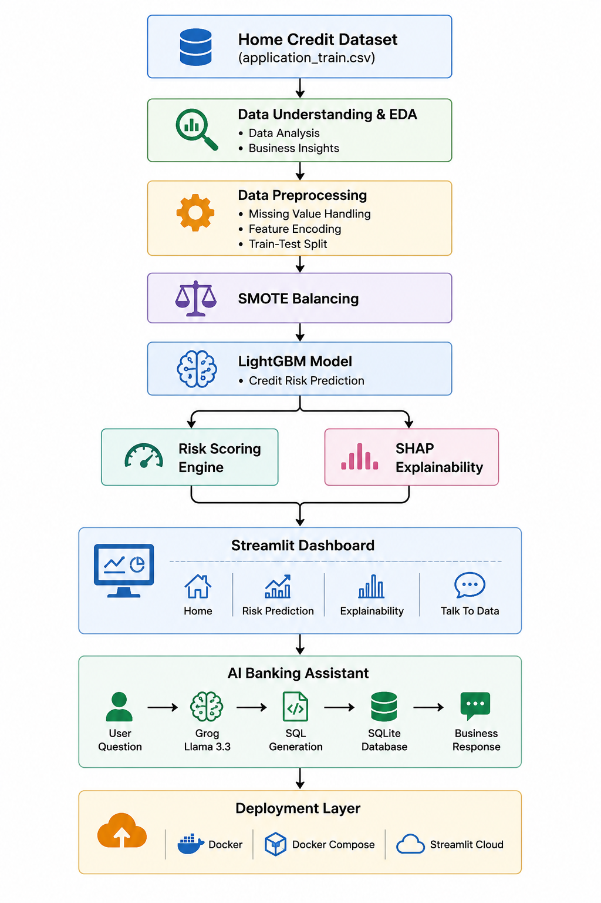
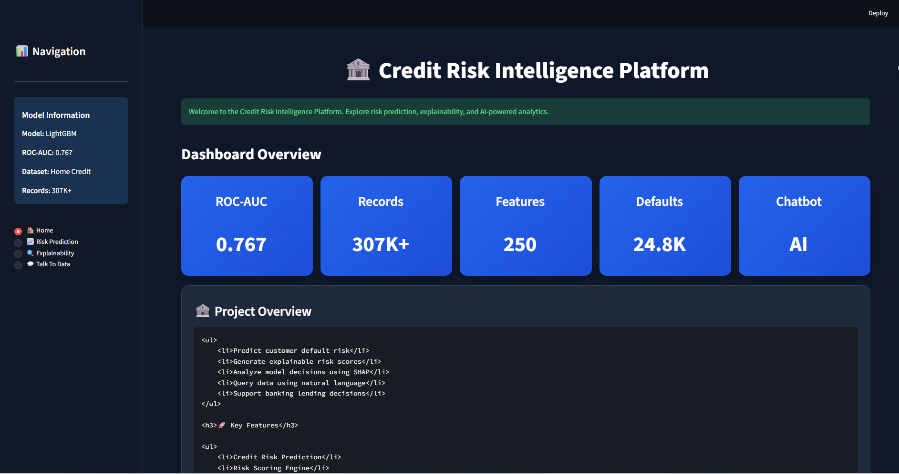
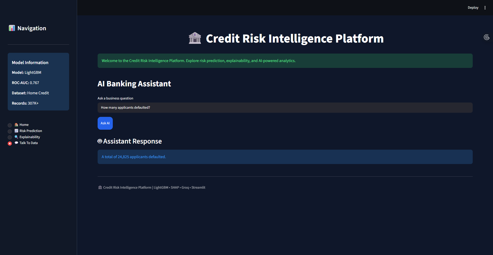

# 🏦 Credit Risk Intelligence Platform

## Overview

The Credit Risk Intelligence Platform is an AI-powered decision support system developed to assess customer creditworthiness, predict loan default risk, and generate business insights from credit data.

The platform integrates Machine Learning (LightGBM), Explainable AI (SHAP), and Natural Language Analytics (Groq Llama 3.3) within an interactive Streamlit dashboard to support transparent and data-driven credit risk assessment.


## Key Features
Credit Risk Prediction using LightGBM
Explainable AI using SHAP
Risk Scoring & Recommendation Engine
Natural Language to SQL Analytics Chatbot
Interactive Streamlit Dashboard
Dockerized Deployment


## Live Demo

Streamlit Application: https://credit-risk-intelligence-platform.streamlit.app/

GitHub Repository: https://github.com/Alisha-2004/credit-risk-intelligence-platform

## Deployment Note

The Streamlit Cloud deployment demonstrates the complete dashboard, risk prediction, explainability, and application workflow.

The NL-to-SQL chatbot requires a SQLite database generated from the full dataset. Since the database file exceeds GitHub size limitations, chatbot analytics are fully available in local deployments where the database is present.


## Problem Statement

Financial institutions process large volumes of customer applications and face challenges in:

* Identifying high-risk applicants
* Explaining model predictions
* Supporting credit approval decisions
* Performing business analytics efficiently

This project addresses these challenges by providing:

* Automated credit risk prediction
* Explainable model decisions
* Risk scoring and recommendation engine
* Natural Language to SQL analytics chatbot


## Dataset

**Dataset:** Home Credit Default Risk Dataset

**Selected File:** `application_train.csv`

**Source:** Kaggle – Home Credit Default Risk Competition

https://www.kaggle.com/competitions/home-credit-default-risk

The Home Credit Default Risk dataset was released by Home Credit Group to support research on credit risk assessment and loan default prediction. For this project, the **application_train.csv** file was selected as the primary dataset because it contains both the target variable (`TARGET`) and comprehensive applicant-level information required for credit risk modeling, explainability, and business analytics.

### Dataset Statistics

- Records: 307,511
- Features: 122 Original Features
- Target Variable: `TARGET`

### Target Definition

- `0` → No Default
- `1` → Default


## System Architecture



Chatbot Pipeline:

User Question
→ Groq LLM
→ SQL Generation
→ SQLite Database
→ Business Answer


## Methodology

### Data Preprocessing

* Missing value handling
* Categorical encoding
* Numerical scaling
* Train-Test Split

### Class Imbalance Handling

SMOTE (Synthetic Minority Oversampling Technique) was applied to balance the target classes.

### Model Development

Three models were evaluated:

| Model               | ROC-AUC |
| ------------------- | ------- |
| Logistic Regression | 0.614   |
| Random Forest       | 0.726   |
| LightGBM            | 0.767   |

LightGBM was selected as the final model due to superior predictive performance.


## Explainable AI

SHAP (SHapley Additive Explanations) was used to interpret LightGBM model predictions and provide transparency in credit risk assessment.

Features:

* Global feature importance
* Local prediction explanation
* Model transparency
* Explainable credit decisions


## Risk Scoring Engine

Risk Score Calculation:

Risk Score = Probability × 100

### Risk Categories

| Score Range | Risk Level  |
| ----------- | ----------- |
| 0 – 30      | Low Risk    |
| 30 – 70     | Medium Risk |
| 70 – 100    | High Risk   |

### Recommendation Engine

* Low Risk → Standard Approval
* Medium Risk → Manual Review
* High Risk → Additional Verification Required


## Natural Language Analytics Chatbot

The platform includes an AI-powered chatbot that allows users to query the credit database using natural language.

Examples:

* How many applicants defaulted?
* What is the average income?
* What is the average credit amount?
* How many female applicants are there?
* Show top 10 highest income customers

Technologies Used:

* Groq Llama 3.3
* SQLite
* Prompt Engineering


## Dashboard


| Home | Risk Prediction |
|------|------|
|  |  |

| Explainability | Talk To Data |
|------|------|
|  |  |


## Project Structure

```text
credit-risk-intelligence-platform/
├── app.py
├── data/
│   └── schema.txt
├── documents/
├── models/
├── notebooks/
├── src/
│   ├── chatbot/
│   └── ml/
├── Dockerfile
├── docker-compose.yml
├── requirements.txt
└── README.md
```

## Technology Stack

### Frontend

* Streamlit

### Machine Learning

* LightGBM
* Scikit-Learn
* SHAP

### AI Assistant

* Groq Llama 3.3

### Database

* SQLite

### Programming Language

* Python


## Installation

```bash
git clone https://github.com/Alisha-2004/credit-risk-intelligence-platform.git

cd credit-risk-intelligence-platform

pip install -r requirements.txt

streamlit run app.py
```


## Docker Deployment

Run the application using Docker:

```bash
docker compose up --build
```

Access the application at:

```text
http://localhost:8501
```

The project is fully containerized using Docker and Docker Compose for reproducible deployment.


## Future Scope

* Real-time loan processing
* Advanced recommendation systems
* Multi-model ensemble learning
* Regulatory compliance integration
* Banking API integration


## Author

Alisha Mary Shibu

B.Tech Artificial Intelligence and Data Science

Muthoot Institute Of Technology and Science
